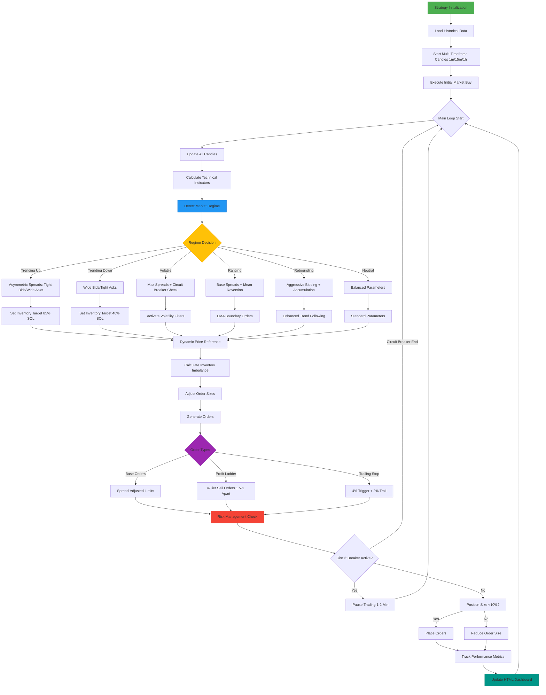

# Adaptive Market Making Strategy Flowchart
**Generated**: 2025-04-05 21:23:18

```mermaid
graph TD
    A[Strategy Initialization] --> B[Load Historical Data]
    B --> C[Start Multi-Timeframe Candles 1m/15m/1h]
    C --> D[Execute Initial Market Buy]
    D --> E{Main Loop Start}

    E --> F[Update All Candles]
    F --> G[Calculate Technical Indicators]
    G --> H[Detect Market Regime]

    H --> I{Regime Decision}
    I -->|Trending Up| J[Asymmetric Spreads: Tight Bids/Wide Asks]
    I -->|Trending Down| K[Wide Bids/Tight Asks]
    I -->|Volatile| L[Max Spreads + Circuit Breaker Check]
    I -->|Ranging| M[Base Spreads + Mean Reversion]
    I -->|Rebounding| N[Aggressive Bidding + Accumulation]
    I -->|Neutral| O[Balanced Parameters]

    J --> P[Set Inventory Target 85% SOL]
    K --> Q[Set Inventory Target 40% SOL]
    L --> R[Activate Volatility Filters]
    M --> S[EMA Boundary Orders]
    N --> T[Enhanced Trend Following]
    O --> U[Standard Parameters]

    P --> V[Dynamic Price Reference]
    Q --> V
    R --> V
    S --> V
    T --> V
    U --> V

    V --> W[Calculate Inventory Imbalance]
    W --> X[Adjust Order Sizes]
    X --> Y[Generate Orders]

    Y --> Z{Order Types}
    Z -->|Base Orders| AA[Spread-Adjusted Limits]
    Z -->|Profit Ladder| AB[4-Tier Sell Orders 1.5% Apart]
    Z -->|Trailing Stop| AC[4% Trigger + 2% Trail]

    AA --> AD[Risk Management Check]
    AB --> AD
    AC --> AD

    AD --> AE{Circuit Breaker Active?}
    AE -->|Yes| AF[Pause Trading 1-2 Min]
    AE -->|No| AG[Position Size <10%?]

    AG -->|Yes| AH[Place Orders]
    AG -->|No| AI[Reduce Order Size]

    AH --> AJ[Track Performance Metrics]
    AI --> AJ

    AJ --> AK[Update HTML Dashboard]
    AK --> E

    AE -->|Circuit Breaker End| E
    AF --> E

    style A fill:#4CAF50,stroke:#388E3C
    style H fill:#2196F3,stroke:#1976D2
    style I fill:#FFC107,stroke:#FFA000
    style Z fill:#9C27B0,stroke:#7B1FA2
    style AD fill:#F44336,stroke:#D32F2F
    style AK fill:#009688,stroke:#00796B
```